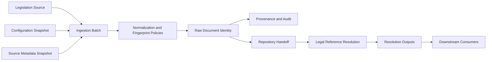
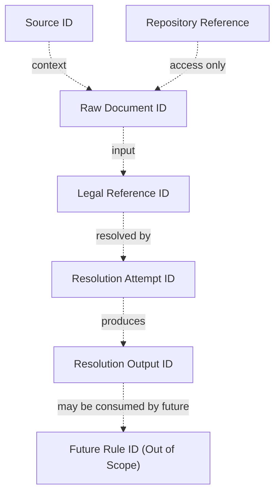
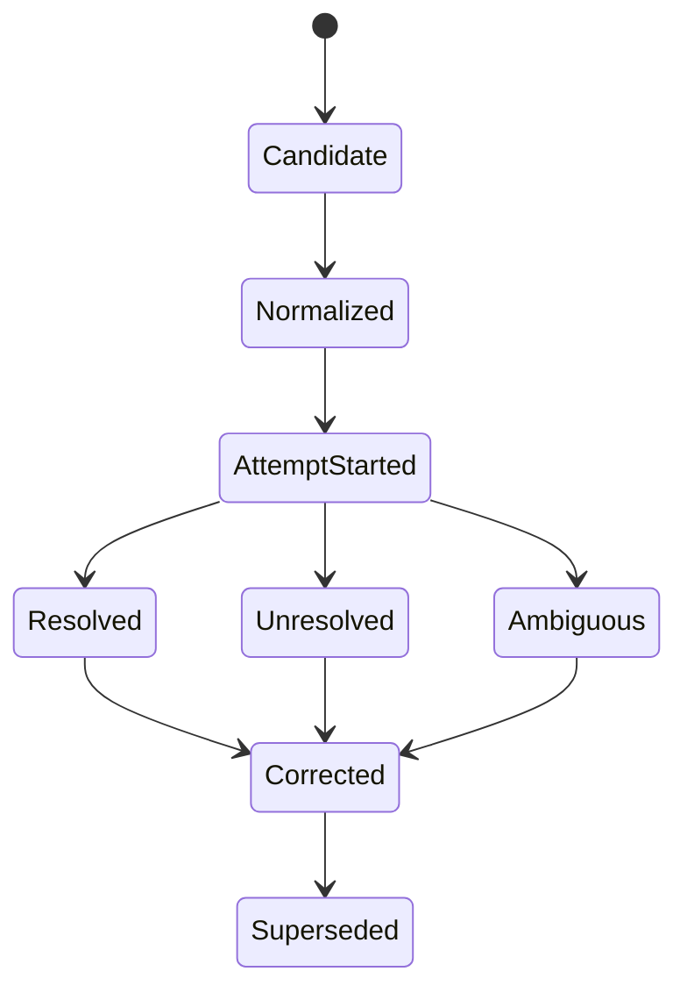

# Architecture Diagrams

## End-to-End Flow

```mermaid
flowchart LR
    Source["Legislation Source"] --> Batch["Ingestion Batch"]
    Config["Configuration Snapshot"] --> Batch
    SourceMeta["Source Metadata Snapshot"] --> Batch
    Batch --> Normalize["Normalization and Fingerprint Policies"]
    Normalize --> RawIdentity["Raw Document Identity"]
    RawIdentity --> ProvAudit["Provenance and Audit"]
    RawIdentity --> RepoHandoff["Repository Handoff"]
    RepoHandoff --> Resolution["Legal Reference Resolution"]
    Resolution --> Output["Resolution Outputs"]
    Output --> Consumer["Downstream Consumers"]
```

## Identity Separation

```mermaid
flowchart TB
    SourceID["Source ID"]
    RawDocID["Raw Document ID"]
    RefID["Legal Reference ID"]
    AttemptID["Resolution Attempt ID"]
    OutputID["Resolution Output ID"]
    RepoRef["Repository Reference"]
    RuleID["Future Rule ID (Out of Scope)"]

    SourceID -.context.-> RawDocID
    RawDocID -.input.-> RefID
    RefID -.resolved by.-> AttemptID
    AttemptID -.produces.-> OutputID
    RepoRef -.access only.-> RawDocID
    OutputID -.may be consumed by future.-> RuleID
```

## Resolution Lifecycle

```mermaid
stateDiagram-v2
    [*] --> Candidate
    Candidate --> Normalized
    Normalized --> AttemptStarted
    AttemptStarted --> Resolved
    AttemptStarted --> Unresolved
    AttemptStarted --> Ambiguous
    Resolved --> Corrected
    Unresolved --> Corrected
    Ambiguous --> Corrected
    Corrected --> Superseded
```

